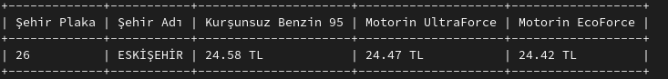
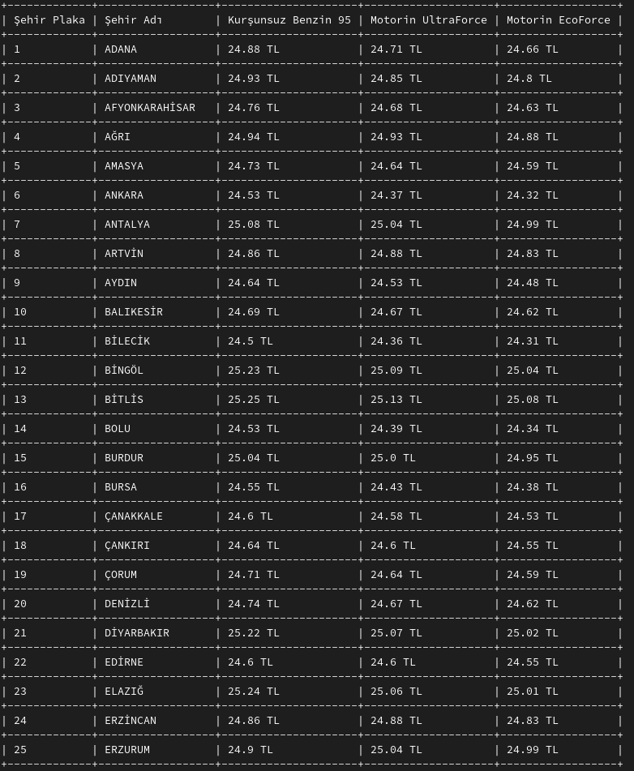

# FuelPrices
View current fuel information for Opet through a console application.

## Usage
To run the application, use the following command:

<code>dotnet /path/to/FuelPrices.dll</code>

## Help Command
Displays the available parameters within the application. To use the help command, run the following command:

<code>dotnet /path/to/FuelPrices.dll -h</code>

This command will show the available parameters and usage instructions.

## Example Output for Parameterized Query
The screenshot below shows an example output for a query with parameters:

In the above output, you can see the current fuel prices for Opet based on a specific city and fuel type.

## Example Output for Non-Parameterized Query
The screenshot below shows an example output for a query without parameters:

In the above output, you can see the current fuel prices for all cities and fuel types offered by Opet.

---

Enhancements:
- Specified the use of the "dotnet" command to run the application.
- Added instructions for using the help command to display available parameters.
- Included screenshots to provide clearer examples of the output.
- Emphasized the need to replace "/path/to/" with the actual file path where the application is located.

With these enhancements, the README file for the FuelPrices application becomes more understandable and user-friendly.

